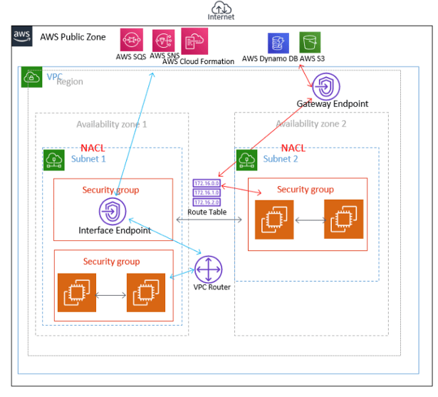

# VPC Endpoints

A VPC endpoint enables you to **privately connect your VPC to supported AWS services** and VPC endpoint services powered by AWS PrivateLink without requiring an internet gateway, NAT device, VPN connection, or AWS Direct Connect connection. 

Instances in your VPC do not require public IP addresses to communicate with resources in the service. **Traffic between your VPC and the other service does not leave the Amazon network.**

VPC Endpoints are **virtual devices that are horizontally scaled, redundant, and highly available VPC components**. VPC endpoints allow communication between instances in your VPC and services, without imposing availability risks or bandwidth constraints on your network traffic.

## VPC endpoint has two types

### VPC Gateway Endpoints

* **allows you to provide access to Amazon Simple Storage Service (S3) and Amazon DynamoDB**
* associated with a VPC (not a subnet)
* uses IAM Policies or resource policies to restrict access
* when associated with a route table, the route table automatically updates the prefix list of service and target endpoints

### VPC Interface Endpoints

* **allows you to connect to AWS services powered by AWS PrivateLink**. It also can also include services hosted by other AWS customers, and AWS Partner Network (APN) partners in their own VPCs
* associated with a subnet, so for HA, we need to put one in each AZ 
* is actually an Elastic Network Interface (ENI) and is associated with a security group
* does not use route tables

